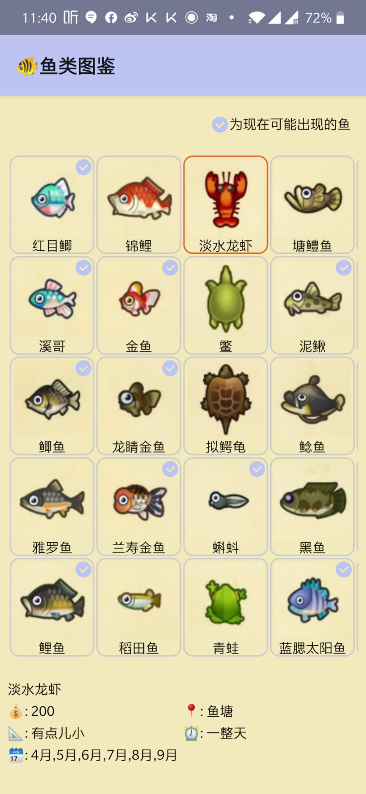

# AnimalCrossingHelper
## Feature(s) available now:
My initial goal is to make this app a "swiss army knife" app
### Fishing Index
Having the exact ordering of the fishing index in app so it's super easy to cross-reference with your own record. The checkmark will show what fish are available for you. Good luck fishers.

## Features I will be working on:
1. Turnips trading dashboard, where app shows a list of users' turnips price and their islands' access code so villigers can find the best island to sell their turnips.
2. QR code generator. Generate QR code by importing pictures.

## Featires I might be working on(please please contribute to it)
1. add southern hemisphere info for fishing index
2. add English/other languages for index
3. add other index, such as bugs, villagers, npcs, ... etc

## Where can I download this app?
### Android
https://exp-shell-app-assets.s3.us-west-1.amazonaws.com/android/%40t238wang/acnh-helper-854de302af2c4a0794269f00ff19a5a9-signed.apk

### iOS
please clone this repo, register expo, run expo yourself. 

## Supported/Tested devices
This app works on OnePlus7Pro and iPads. I know this won't work on some smaller devices because they nasty way I organize UI. I will fix when I got a chance, or, please contribute.

